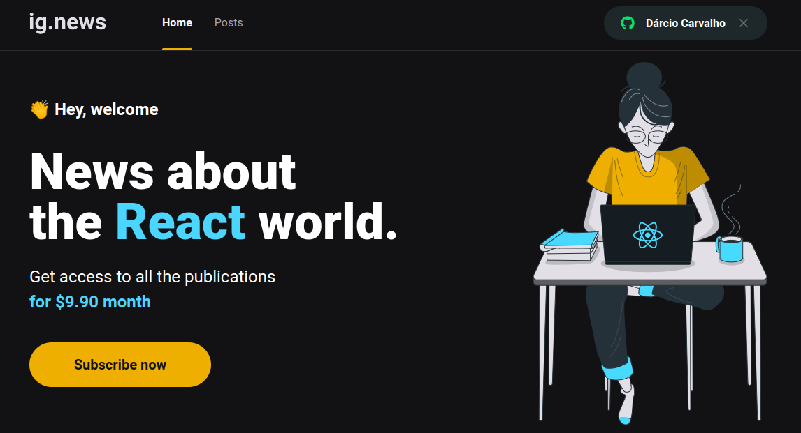

# REACT - IGNEWS 
## Blog com acesso restrito a assinantes
#

  

  

## 💻 Projeto

Blog com acesso restrito a assinantes, o usuário poderá se logar através de sua conta do Github e acessar a lista de posts do blog.

Para ter acesso ao conteúdo completo de cada post, o usuário deverá fazer a sua inscrição (fictícia). 
Ao clicar no botão "Subscribe now", o sistema direcionará para a página de Pagamento do Stripe, onde o usuário preencherá seus dados e do cartão. 
Como o sistema está em modo TESTE, utilize o cartão de teste de número `4242 4242 4242 4242`

  

[ACESSE A APLICAÇÃO](https://ignews-knuimv104-darciocarvalho.vercel.app/)

## ✨ Tecnologia

- [Next.js](https://nextjs.org/)
- [Typescript](https://www.typescriptlang.org/)
- [Fauna DB](https://fauna.com/)
- [Prismic](https://prismic.io/)
- [Stripe](https://stripe.com/br)
- [Jest](https://jestjs.io/pt-BR/)

## 🚀 Como executar

- Instale o [Node.js] na versão 16.16.0 ou inferior(https://nodejs.dev/)
- Instale o [yarn](https://yarnpkg.com/)
- Instale os pacotes com `yarn` ou `yarn install` .
- Crie um arquivo oculto no diretório raiz da aplicação chamado ".env.local" 
  seguindo a instrução do arquivo ".env.example" .
- Execute `yarn dev` para iniciar o cliente web.

### 🛠️ Para executar o Webhook

O Webhook é um recurso que possibilita o sistema se comunicar com outro sistema, na aplicação
IGNEWS foi utilizado um Webhook para receber informações do Stripe, sistema de pagamento, para gerenciar  
os eventos referente a inscrição do usuário, como criação, atualização e cancelamento.

- Instale o [Stripe CLI](https://stripe.com/docs/stripe-cli) 
- Entre na sua conta de usuário Stripe no navegador.
- Abra um novo terminal e execute `stripe login` para acessar o Stripe CLI.
- Execute `stripe listen --forward-to localhost:3000/api/webhooks` para ativar o webhook.

_<B>OBS.:</B> Se não executar o Webhook, a funcionalidade Subscribe (Inscrição) não funcionará como planejado._

## 🔖 Layout

Você pode visualizar o layout do projeto através do link abaixo:

- [Layout](https://www.figma.com/file/gl0fHkQgvaUfXNjuwGtDDs/ig.news/duplicate)

Lembrando que você precisa ter uma conta no [Figma](http://figma.com/).

## 📝 License

Esse projeto está sob a licença MIT. Veja o arquivo [LICENSE](LICENSE) para mais detalhes.

---

  Feito com 💙 by Dárcio Carvalho

  Desenvolvido by Rocketseat :wave: <a href="https://discord.gg/rocketseat">Participe da nossa comunidade!</a> 

